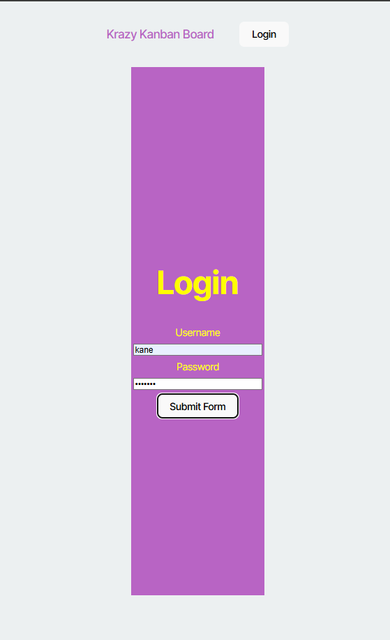

# K-Kanban-Board
  
  ## Description
  This application provides you with a Kanban Board where you can login to an account and make a to do list. When a user logs in, it will make sure that the login information username and password are valid, after that, it will generate a token and saves it into the local storage. When you logout, this token will be deleted from your local storage. So, all is good.
  ## Table of Contents
  * [Installation](#installation)
  * [Usage](#usage)
  * [Credits](#credits)
  * [License](#license)
  * [Badges](#badges)
  * [Features](#features)
  * [How to Contribute](#howToContribute)
  * [Test](#test)
  ## Installation
  This application will be deployed to render. The link will be included at the end of this file.  
  This application will also be available on github. In order to get access to this repository, you will need to do a git clone to your local device.
  Do "npm install" once you have cloned the repository. Then, if you want to see it locally, do "npm run start:dev".
  ## Usage
  When user follow the deployed link to the deployed WebApp they will be required to login into an account before they can look at their Kanban Board. Once login information is verified and user have been given a token, then user can check out their kanban board.   
  ## Credits
  N/A
  ## License
  MIT 
  ## Badges
  N/A
  ## Features
  * When you open the terminal and input "node index.js" you will be given multiple questions.
  * Once all the questions are answered, a generated.md will be created and will have all the responses provided on the questions.
  ## Deployed Link To The Website Application
  Follow the link to the deployed WebApplication: https://k-kanban-board.onrender.com
  ## How to Contribute
  You can reach out to me by using the contact information below
  ## Questions
  Contact:
  * Name: Kane Esasta
  * Email: kaneesasta@gmail.com
  * Github: [kaneganteng](https://github.com/kaneganteng)